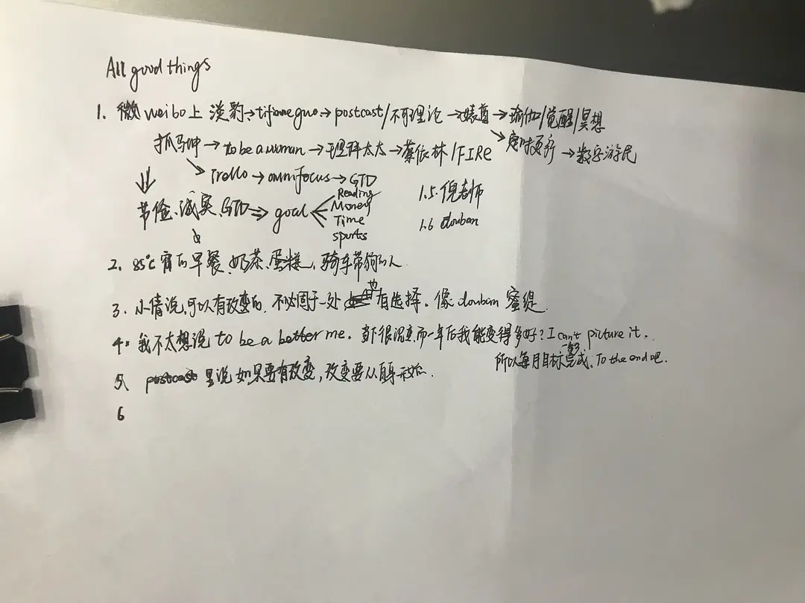
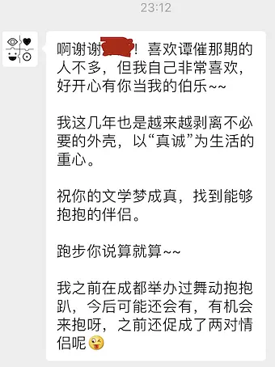
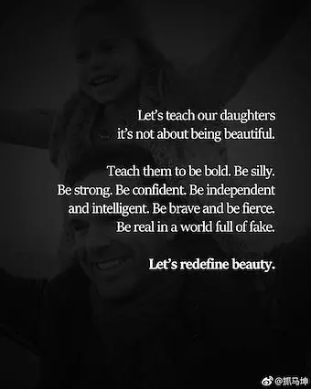

Written on August 2019.

如在广播中所说，我的问题是我如何才能感受到被爱和幸福，觉得人生是充满意义而且是有奔头的。我先认为理性的、逻辑的科学方法和时间管理方法能解决问题，所以去看《逻辑十九讲》、《four hours a week》；后来觉得哲学才能救我，所以去看《何为良好生活》《哲学 科学 常识》《边界-浙江村》《禅与摩托车维修艺术》。大半年过去，问题仍然存在。

年初的关键词是 GTD、真诚、分享。在年中的述职报告时，在与一位朋友见面时，在与朋友的日常交流时，我常常能想到这个词。在心态上我受益于这个态度：当我真诚地与分享我的生活、观点（很少）后，我能比较坦诚地面对自己，不太计较后续的结果。但在实际上尤其是工作中我无受益。真诚本质上是对自己坦诚然后对别人坦诚，这是唯一值得的生活态度，所以我选择继续执行。

真诚或者说坦诚的态度来源于两位网上的陌生人，婊酱播客的 Jess 和微博上的抓马坤。前者的播客中 Jess 跟嘉宾谈论“谭催不是性”的那期播客里，Jess 和嘉宾讲到她们的成长经历以及自我相处与观察。在听她们播客时，我能体会到她们的真诚——面对自我、面对瑜伽、面对外人时，她们都不是一种“我知道这东西、我知道这事情如何处理”的自大态度，而是“我看见或察觉了这件事或这个问题，我来试试这个问题能否解决”的谦逊态度；我清楚记得嘉宾讲到她与母亲的关系时，她说：“只有我变了我才能体会到外界的变化”。我喜欢她们的态度、谈论问题的方式，也认为这样与世界相处才是有趣的方式，不让人失去兴趣的方式。

而之所以想写这篇日志，也是因为 8 月初我终于找到 Jess 的公众号。我给她发消息后，她给我的回复让我觉得 8 月值得记录。

微博上的抓马坤老师是个很厉害的戏剧导演，她在微博上分享同行或自己有趣的、怪异的、励志的故事、给予她帮助和温暖的人，甚至她作为亚洲女性在美国白人戏剧导演圈所受到的歧视而作出的反抗——以她的能力做出优秀的作品，这些都给人力量。我第一次知道 FIRE（financial independent retire early）是通过她的微博。故事中的老人非常节俭地生活，竭毕生积蓄为自己的母校捐款。她讲要理性消费，不要让自己宝贵时间换来的钱付之流水，而是发挥更大的价值。这些都有影响到我对生活的态度。甚至在我工作时，我也会想到在女性占少数的科技公司，我受到歧视时该怎么办。相比较与女性同事竞争，我更应该与她们联合起来共同进步，争取在本不占优势的工作环境中争取利益。甚至在生活中，我也应该与我的女性朋友相互帮助扶持，在这个女性并不占优势的社会环境中争取女性的利益。她分享过的图片：

“be strong, be confident, be independent and intelligent, be brave and fierce, be real in a world full of fake.” 我深以为然，也以此为目标。如果我成为一名女权主义者，有 60% 是因为抓老师的影响。

上半年四月份以来开始在大操房跟着老师做力量训练。我清楚健身的目的不是马甲线翘臀，是身体各部分力量的增长：腰腹部和臀腿的力量能让我长跑时跑得更快的同时避免膝盖受伤，从而能跑得更长久。腰腹部和上肢力量能让我攀岩的时候支持整个身体的力量，从而体验攀岩的乐趣。健身的过程中认识肌肉，体验肌肉发力的感觉，体验到身体部位的觉知，体验到人对身体的控制，体验到流汗、思想放空，这些才是健身的乐趣所在。甚至我看到健身教练的美感不在于身材，而在于运动过程中动作的标准和到位，是运动过程中的美。我有时候会刷豆瓣话题“撸铁照片”，有时候理解不到翘臀的美。我理解大家对翘臀的追求，我知道我不要（也可能是练不出来）。就像在等公交车时看女孩子们画了很不错的妆觉得很青春靓丽，而我却不想为这事情付出精力，只想着该如何解决我的“大问题”。健身房卡 11 月份初到期，我也面临换房子的问题，珍惜 9-10 月份的训练吧。

这算是今年以来的思想总结。具体事项总结找时间再写。

想到明天继续上班我有点丧。但世界不能交到讨厌的人手里，所以还是得努力去做事情。

> 版权归作者所有，任何形式转载请联系作者。  
> 作者：花吃（来自豆瓣）  
> 来源：https://www.douban.com/note/733531382/
