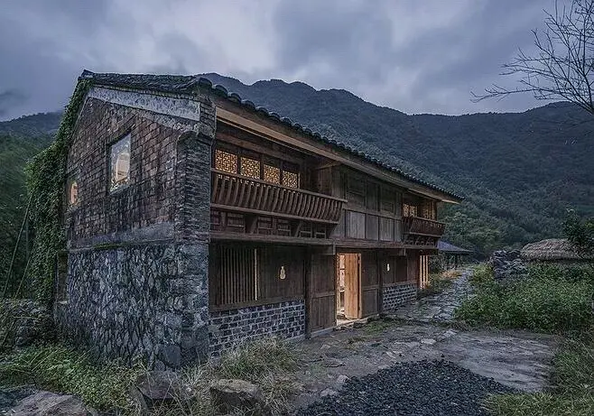
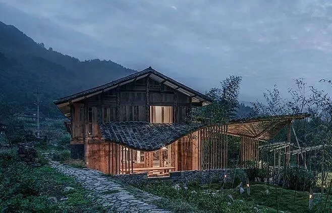

 

从村子往北走两里路能走到房子门口，周围是田地，稍远处是茂盛的草木，再远处是山。

亮灯的房子像人生最终极的向往。如果住在那里，在夏天凌晨四点钟，应该能看到夜色散去而朝霞还没聚拢到东方的清冷场景。而日落之后，薄雾比夜色早一步涌来， 远山只剩轮廓，天和门前石子辉映出彼此的浅青色，从房子窗口里透出的黄光是我最想要的归宿。

“从清晨到日暮”。 
《亲爱的小孩》里唱：“聪明的小孩今天有没有哭，是否丢失了心爱的玩具，在风中寻找，从清晨到日暮。”

