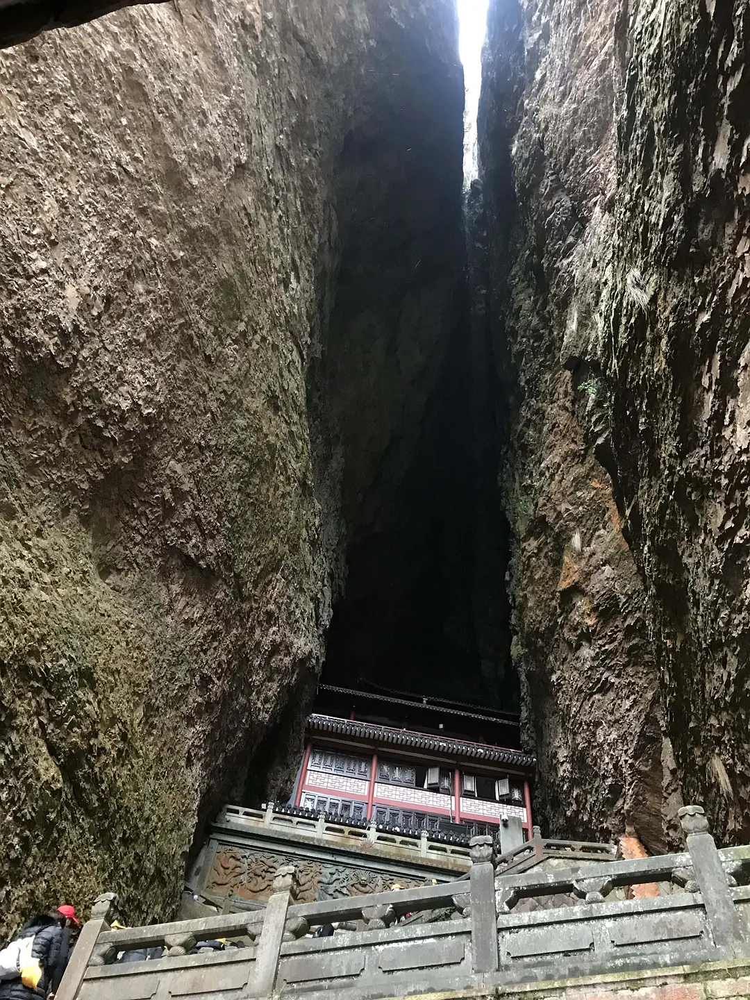
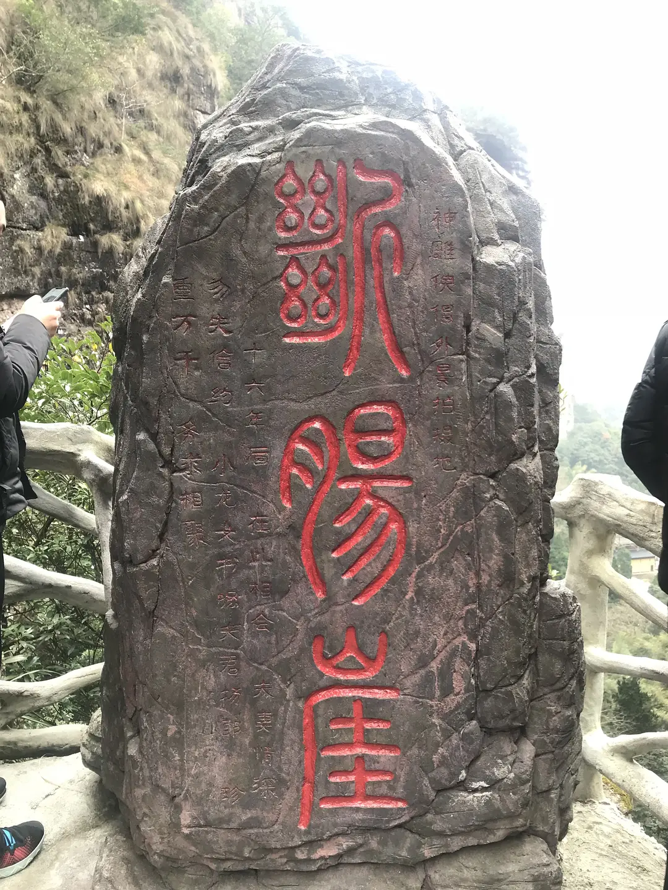
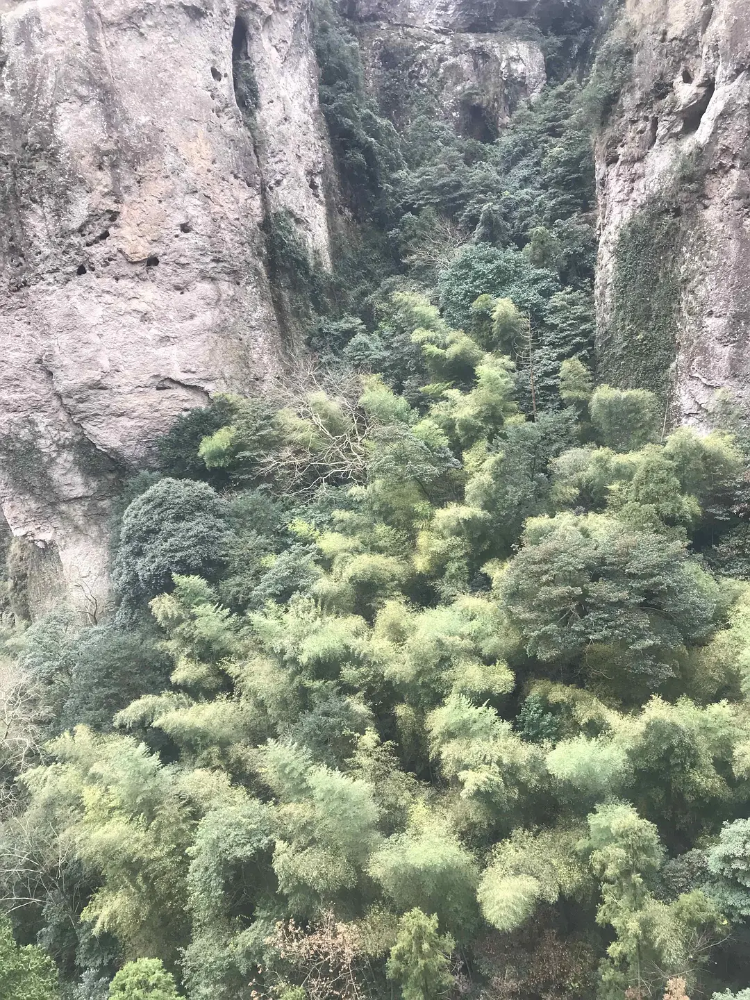
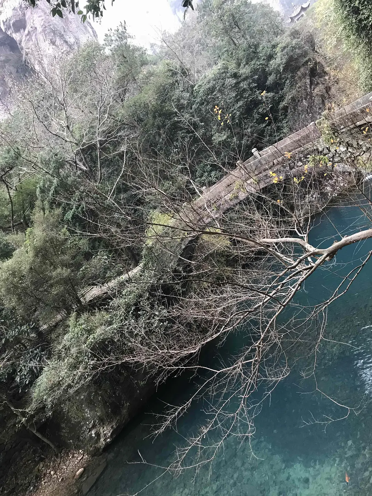

Written on the 2019-01-15 23:55:31.

雁荡山水清山秀，空气清新。至于山的形状像千佛像、夫妻像公鸡母鸡，或者像鳄鱼，都是众人的想象，为叙述而编织的梦。

倒是山脚下的大雄宝殿气宇轩昂，如来佛祖端坐正堂，其余众佛绕殿围绕佛祖一周。殿门口的香炉内蜡烛的香味熟悉，让我想起小时候停电时点的白蜡烛；斜背暗土黄色布袋的众信徒，如蚁群浩荡从左前方赶来，掏出布袋里自己准备的香，先向佛祖借火再向佛祖敬香。太冷清到太热闹只差几分钟，不知道佛祖会不会嫌太吵。

山间的菩萨庙也很气派。巍巍峨峨地向山上走，两个山体的夹缝中生出一座庙，像是在石头缝里开的一朵花，或者长的一颗蘑菇。供奉的观世音菩萨永远不见天日，但面前两个大香炉前永远香火满满。菩萨的金色和香火的红色相互映衬，震撼得我不敢拍照，也当然不敢跟菩萨对话或向菩萨许愿。心不诚做样子的话自己都觉得不好意思。

断肠崖的石刻上，小龙女写：“十六年后，在此相会，夫妻情深，务失信约。小龙女书_夫君杨郎，珍重万千，务来相聚。”然后她跳下去，沉入千年深潭。为什么有人喜欢在断肠崖旁边合影？明明是很悲伤的地方。

断肠崖下并非千年深潭，倒是不远处是名为小龙湫的瀑布。说是瀑布，也不过是两三人可合抱住的水柱。

断肠崖再往上有卧龙潭，水清、水静、水碧绿。如果天气好，在水边静坐将会是很美妙的体验。

从断肠崖外下走，看到了层叠的绿。我很喜欢。好像是想起了《卧虎藏龙》中玉娇龙与李慕白的那场较量，或者是另外一部电影的场景。总之觉得层叠的绿温柔、接纳我、可抚慰我；而碧绿的卧龙潭则逼我清醒、向内观。在潭水边静坐完的人，也许就一头扎进层叠的绿里了。

还有坐在小店广场前看飞渡表演。白色的塑料桌和塑料椅，透明的玻璃杯，不太香的绿茶用并非滚烫的热水瓶里的水冲出来，味道一般，但双手捧着杯子喝茶觉得好温暖；这就是我想要的旅途中的犒劳。好像人生爬上了一个台阶，想追求的不过就是一杯热茶，一把可以坐下来好好休息、欣赏风景的椅子。飞渡表演的第一段是表演者从山顶顺着绳子往下滑，中途模仿采集草药的情景和动作。在继续上山的路上，我无可避免地想到了蹦极，想到我第一次有强烈的冲动想去蹦极，是想体会极端情况下把自己交给队友，或者在绝望情况下有队友在身边的感觉，或者是一起去死的感觉。

大龙湫瀑布兀自流，水从最高峰一路蜿蜒而下，遇到悬崖就跳下来，溅起的水花或者水雾打湿强行走到水帘下拍照人的头发。瀑布下，一汪水清清，从水汪中流出去的溪流清清。朴树真的是一种树。层峦叠嶂的绿，也有掉光叶子、枝桠伸向天空的树。总之是从头到尾的孤独。

有这种体会，从内部来看，是我告诫自己新的一年要诚实面对自己，既然我身子一大半都倾斜在孤独里，就彻底进来吧，别拉扯到另一面自己扮演合群的同事或者知心的姐姐。从外部来看，是在看的小说，是没出太阳的天气。

总之，是一个记录。
